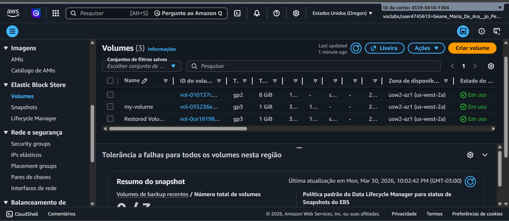
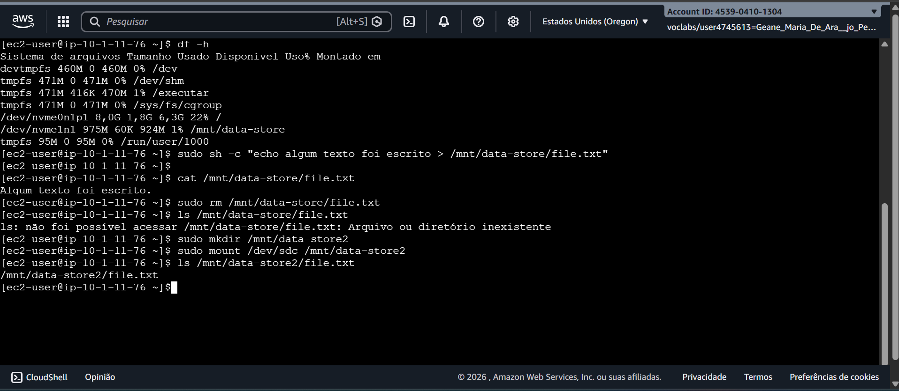

# AWS Hands-on: Gerenciamento de Armazenamento com Amazon EBS ☁️

Este repositório contém a documentação técnica do laboratório prático de **Amazon Elastic Block Store (EBS)**, realizado no ambiente AWS. O objetivo foi gerenciar o ciclo de vida de volumes de armazenamento e implementar estratégias de backup e recuperação.

## 🎯 Objetivos do Projeto
* Criar e configurar volumes EBS (Elastic Block Store).
* Anexar e montar volumes em instâncias EC2 Linux.
* Implementar backup e recuperação de dados utilizando Snapshots.

---

## 🛠️ Etapas Técnicas

### 1. Provisionamento e Conexão
Criação de um volume **EBS tipo gp3 de 1 GiB** na mesma Zona de Disponibilidade (AZ) da instância EC2. O volume foi anexado com sucesso à instância de laboratório.

### 2. Configuração do Sistema de Arquivos (Linux)
No terminal, realizei a preparação do disco para uso:
* **Formatação:** Criação do sistema de arquivos ext3 via comando `sudo mkfs -t ext3`.
* **Montagem:** Criação do ponto de montagem em `/mnt/data-store`.
* **Persistência:** Edição do arquivo `/etc/fstab` para garantir que o volume seja montado automaticamente após reinicializações.

### 3. Backup e Disaster Recovery (Snapshot)
Simulação de um cenário real de proteção de dados:
1. Criação de um arquivo de teste (`file.txt`) no volume montado.
2. Criação de um **Snapshot** do volume (armazenado no S3).
3. Deleção proposital do arquivo original.
4. **Restauração:** Criação de um novo volume a partir do Snapshot e remontagem em `/mnt/data-store2`, validando a integridade dos dados recuperados.

---

## 🚀 Conclusão
O laboratório validou a eficiência do Amazon EBS para armazenamento persistente e a facilidade de recuperação de dados através de Snapshots, garantindo a continuidade do negócio em casos de falhas ou deleções acidentais.

---
**Curso:** Gestão da Tecnologia da Informação (GTI)  
**Foco:** Cloud Computing & AWS
